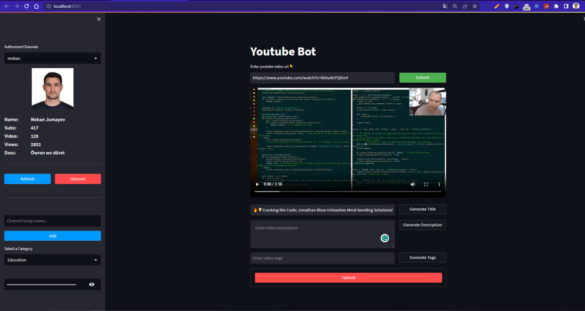

# Youtube Interactor with OpenAI Integration

**Youtube Interactor** is a comprehensive toolkit for interacting with YouTube through an intuitive Streamlit-based interface. With a wide range of functionalities, from video uploads to OpenAI-powered title generations, this project simplifies YouTube channel management and introduces next-gen capabilities to the platform.

# Features:
1. **Google Authorization:**
    - Seamlessly integrate and authorize your Google account.
    - Support for multiple channel authorization.
2. **Video Management:**
    - **Download**: Directly download videos to your machine.
    - **Upload**: Introduce new content to your channel without visiting the YouTube platform.
    - **Update/Delete**: Make modifications or remove content with ease.
3. **Comments Management:**
    - Add comments to videos.
    - Respond to existing comments for more engaging interactions with your audience.
4. **Search Functionality:**
    - Easily search for videos across YouTube.
5. **OpenAI Integration:**
    - Generate compelling video titles, descriptions, and tags using state-of-the-art language models.
  
# Built With:
- **Streamlit**: For interactive web-based applications.
- **Google Cloud**: Powers the Gmail and YouTube API integrations.
- **OpenAI**: The magic behind the AI-driven features.

# Contributing:
Feel free to contribute to this project. Fork the repository, make your changes, and submit a pull request. Suggestions, issues, and feedback are welcomed!

Happy YouTubing! 🚀🎥
